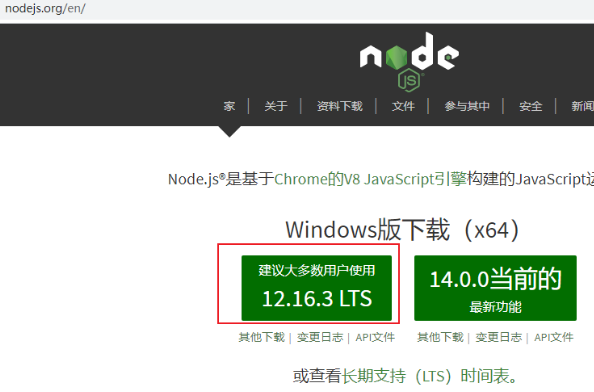
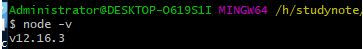
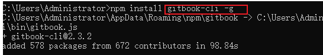
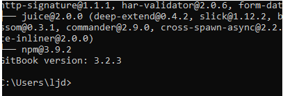
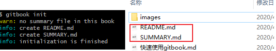
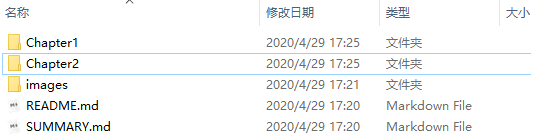
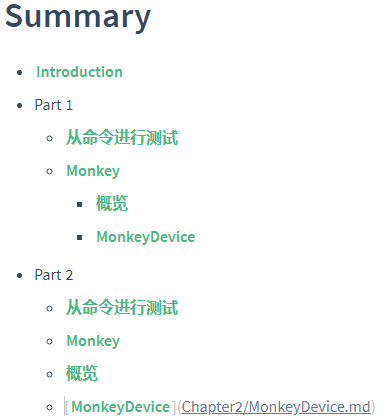
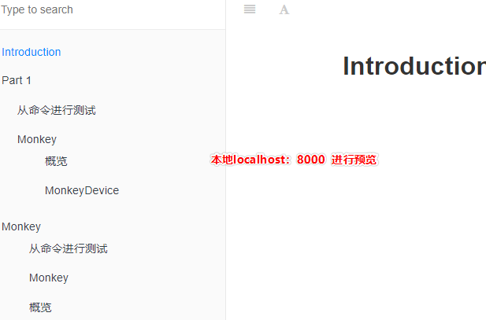

### gitbook的使用教程

> 一、安装

- 1、下载地址：https://nodejs.org/en/

  

- 2、下载后安装

- 3、右键一路安装，安装完成

  在CMD窗口，输入 `node -v`

  

  当看到版本号的时候，说明已经安装成功。

> 二、使用方法

- 1、切换npm源的方法

  `npm install -g nrm`安装nrm管理

  输入`nrm ls`列出安装源地址：

  ```shell
  *  npm ---- https://registry.npmjs.org
     cnpm --- http://r.cnpmjs.org/
     taobao -http://registry.npm.taobao.org/
     eu ----- http://registry.npmjs.eu/
     au -----  http://registry.npmjs.org.au/
     sl ----- http://npm.strongloop.com/
     nj -----  https://registry.nodejitsu.com/
  带*的是当前使用的源，上面的输出表明当前源是官方源。
   $ nrm use taobao
   Registry has beensetto: http://registry.npm.taobao.org/
   使用淘宝安装源
  ```

  `nrm最常用的命令`

  ```shell
  1.nrm ls 查看已有的源 
  2.nrm add <源名称> <源地址> 新增源 
  3.nrm use <源名称>切换到现有的源
  4.nrm test  测速
  ```

> 三、安装GitBook，命令行输入下述命令

①	管理员身份运行`CMD`

```shell
npm install gitbook-cli -g
#如果是mac系统linux安装出错可能需要权限执行以下代码
sudo npm install gitbook-cli -g
```



注意：安装速度有点慢，需要等一会儿！安装示例图。

②	查看是否安装成功，命令行输入下述命令，出现版本号则已安装，否则无

`gitbook -V(注意这里的v是大写)`

安装此时安装CLI版本，安装完的样子。



> 四、GitBook创建以及预览使用

- 1、`gitbook init`

  进入到指定的文件夹执行cmd命令，初始化文件夹，会自动生成两个必要的文件README.md

  和SUMMARY.md

  

  **README.md**:书的介绍文字，如前言，简介，在章节中也可作为章节的简介

  **SUMMARY.md**：定制书籍的章节结构和顺序。

- 2、在gitbook的使用文件夹下面增加其他章节的文件，文件目录如下:

  

- 3、GitBook使用SUMMARY.md文件作为书记的目录结构，可以用来制作书籍目录。

  

- 4、预览

  ①	执行命令`git server`,gitbook 会启动一个4000端口用于预览

  

  ②	第二种预览方式，运行`gitbook build`命令狗会在书籍文件夹中生成一个_book文件夹的内容即为生成的html文件，生成网页不需要开启服务器。

  ```shell
  注意：
  当执行gitbook serve后保存找不到fontsettings.js
  一般的降低版本
  其他解决办法：先执行一次gitbook build,在执行gitbook serve就不会报错了！
  ```

> 五、安装插件

安装插件只需要在书籍目录下增加`book.json`文件，例如增加`折叠目录`的插件，需要在book.json内增加下面代码：

```json
{
    "plugins": ["expandable-chapters-small"],
    "pluginsConfig": {
        "expandable-chapters-small":{}
    }
}
//常用插件
{
    "plugins": [
         "back-to-top-button",//回到顶部插件
         "expandable-chapters",//目录扩展，还可以
          "splitter"//安装的时候次软件没有安装成功
        "-lunr", "-search", "search-pro",//这3个支持中文搜索
    ]
}
```

然后终端执行`install`来安装插件即可。

`gitbook install`

TIP：至于插件可以再https://www.npmjs.com/search?q=gitbook进行搜索安装

> 六、常见问题

- 1、gitbook渲染的时候出现错误 template。比如在渲染django模板的时候出现问题？

  解决办法：在代码的最前面和最后面添加` 代码区域`

  ---

  2、如何将文档上传到coding？

  执行gitbook build后，将_book文件夹里的文件上传到coding网站。

  ----

  3、gitbook新版本"gitbook build"命令导出的html本地不能跳转的问题解决

  解决办法：在导出的文件夹目录下找到gitbook->theme.js文件

  - 找到下面的代码（搜索 `if(m)for(n.handler&&`）
  - 将if(m)改成if(false)

