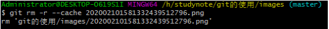

## git的使用教程

> 一、安装地址：http://git-scm.com


根据电脑使用的版本进行下载。

> 二、创建教程

- 安装完成之后，右键`git bash here`输入`git --version`查看版本号，当看到版本号的时候，说明已经git安装成功。


- 设置用户名和邮箱，尽量和github账号一致。

  ```shell
  git config --global user.name topljd（您的用户名）
  git config --global user.email 820230548@qq.com（您的邮箱地址）
  ```


- 创建工作区，在需要创建的文件夹内右键，选择`git bash`

  创建工作区的时候，要在想要创建的文件夹内。

  例：`在G:\git文件夹下创建工作区`，在当前文件夹下右键选择`git bash`在shell端输入`git init`初始化，此时会产生.git问价夹，这文件夹是隐藏的，里面的文件不用管即可。

  
> 使用案例：

- 1、创建readme.txt文件，并增加到缓存区

  `git add 的几种参数区别`

  ```shell
  git add readme.txt  //将readme.txt这个文件增加到 暂存区
  git add .			//这个 点 表示当前目录下的所有文件，,保存新的添加和修改，但不包括修改
  git add -A			//保存所有的修改
  git add -u			//保存修改和删除，但是不包括新建文件
  ```

- 2、commit提交到版本区

  ```shell
  git commit -m "1、添加readme.txt文件"	//后面引号内的内容为 注释
  ```

  

- 3、推送到远程的服务器

  ```shell
  git remote add origin https://github.com/topljd/blog.git	//远程连接仓库
  git push -u origin origin master //推送到服务器,origin远程库名，master分支
  ```

  这个时候提交，会让您输入用户名和密码，进行验证登录。验证通过后，如图二。

  


- 4、其他

  ```shell
  git log 	//查看记录
  ```

  

  ```shell
  git status		//查看当前状态
  ```

  

  ```shell
  git log --pretty=online 6a59ff31		//查看版本
  git reset --hard 6a59ff31				//回滚到某个版本
  ```

  创建分支

  ```shell
  git checkout -b iss53  //创建一个iss53的分支，并切换到iss53这个分支
  //上面是下面代码的简写
  git branch iss53 	//创建iss53分支
  git checkout iss53	//切换到iss53分支
  ```

  

- 5、在github.com上创建服务器（https://github.com）

  在创建仓库的是时候直接在网页端进行创建

  ```shell
  //create a new repository on the command line
  git init				//创建git项目
  git add readme.txt		//将版本说明添加到 暂存库
  git commit -m 'first commit'	//提交到版本库，后面的为说明注释
  git remote add origin https://github.com/topljd/blog.git	//远程连接仓库,blog.git表示新建的仓库
  git push -u origin master		//推送到服务器
  ```

> 三、git使用常见的问题

- 1、**提交不了的时候，显示如下错误**

  ```shell
  failed to push some refs to 'https://github.com/topljd/studynote.git'
  hint: Updates were rejected because the remote contains work that you do
  hint: not have locally. This is usually caused by another repository pushing
  hint: to the same ref. You may want to first integrate the remote changes
  hint: (e.g., 'git pull ...') before pushing again.
  hint: See the 'Note about fast-forwards' in 'git push --help' for details.
  ```

  解决：原因是远程库中有 某个文件，但是本地提交的时候没有。

  解决办法：可以通过如下命令进行代码合并[注:pull = fetch + merge]

  ```shell
  git pull --rebase origin master
  ```

  

  以上会将远程库里的文件下载到本地文件夹！然后再进行提交。

  ```shell
  git push -m study master
  ```

- 2、**如何删除远程github项目**

  

  找到Danger Zone ，最下面的`delete this repository`

  

  点击后，会提示 确认是否真的要删除。

- 3、**如何删除github库里面的某个文件**

  因为在github上不能直接删除某个文件，所以必须用git命令去删除，在上传的的项目文件里打开git，找到要删除的文件。`202002101581332439512796.png`

  

  `git pull --rebase origin master`或者`git pull origin master`将github上的文件重新拉取下来，其中origin是库的别名，master是分支。

  

  当下载到本地时，输入命令`dir`查看目录下的文件，如下图

  

  再次输入命令`git rm -r --cache202002101581332439512796.png ` 删除磁盘上的该图片。

  

  再输入`git commit -m '删除了202002101581332439512796.png'`提交添加说明如下图：

  

  最后输入`git push -u origin master`更新github仓库，如下图：

  

  再次远程查看，文件就被删除了。

  

- 4、**当出现master warning: LF will be replaced by CRLF in www/css/style.css.>**

  ```auto
  git config --global core.autocrlf false
  ```

  一般的还是远程仓库中的文件与本地的文件不一致，需要先将远程仓库中的代码拉取到本地！

- 5、**出现上传不了错误提示如下error: cannot pull with rebase: You have unstaged changes.
  	error: please commit or stash themcc**

  解决办法：

  ①	`git pull --rebase`这个命令做了一下内容：

  a.把你 commit 到本地仓库的内容，取出来放到暂存区(stash)（这时你的工作区是干净的）
b.然后从远端拉取代码到本地，由于工作区是干净的，所以不会有冲突
  c.从暂存区把你之前提交的内容取出来，跟拉下来的代码合并
  
  所以 rebase 在拉代码前要确保你本地工作区是干净的，如果你本地修改的内容没完全 commit 或者 stash，就会 rebase 失败
  
  ②还是要听 git 提示的话，要理智，有什么不清楚的，就输入`git status`根据人家提示的来，该提交的提交，stash 的 stash。
  
  ③删除文件后需要 git add -A, 光 git add. 不行，区别如下：
  
  ```shell
  git add 的几种参数区别
  git add -A 保存所有的修改
  git add . 保存新的添加和修改，但是不包括删除
  git add -u 保存修改和删除，但是不包括新建文件
  ```

- 6、**注意：切换分支的时候里面本地文件夹中的文件也会发生变化**

  

- 7、**名字和分支的用法**

  

- 8、**git删除本地分支、删除远程分支**

  ①`git branch -a` 查看所有分支

  ```shell
  $ git branch -a
    coding-pages
    gh-pages
  * master    # * 表示当前分支
  # 下面是远程分支
    remotes/origin/gh-pages
    remotes/origin/master
    remotes/origin_coding/coding-pages
    remotes/origin_coding/master
    remotes/origin_gitee/master
    ########
    $ git branch -r #查看远程分支
    origin/gh-pages
    origin/master
    origin_coding/coding-pages
    origin_coding/master
    origin_gitee/master
  ```

  ②查看当前所在的分支`git branch`

  ③删除本地的XXX分支`git branch -d XXX`

  ​	其中-d表示的delete删除的意思，XXX表示删除的分支名称

  ④删除远程的XXX分支

  `git push origin --delete XXX`

  注意：远程的话一般是双 `-`

- 9、**拉取远程分支并创建本地分支**

  ①`git checkout -b 本地分支名x origin/远程分支名x`

  使用该方式会在本地新建分支X，并自动切换到本地分支X

  ②`git fetch origin 远程分支名x:本地分支名x`

  使用该方式会在本地新建分支X，但是不会自动切换到该本地分支X，需要手动checkout

  ③`git branch -vv`查看本地分支与远程分支映射关系

  ```shell
  $ git branch -vv
    coding-pages df545e4 [origin/coding-pages: gone] 删除所有pages文件
    gh-pages     6d2697e [origin/gh-pages] 2020年5月7日10:42:39
  * master       cdb916a [origin_coding/master: ahead 1] 2020年5月7日10:26:37 提交ignore
  ```

  ④`git branch -u origin/addFile`或`git branch --set-upstream-to origin/addFile`建立当前远程分支的映射。

  

  查看当前本地分支与远程分支映射关系结果如下：

  

  此时再次拉取，成功信息如下：

  `git pull`Already up-to-date

  再次推送，成功信息如下

  `git push`	Everything up-to-date

  ⑤撤销本地分支与远程分支的映射关系

  `git  branch --unset-upstream`使用`git branch -vv`查看映射关系

  

  ⑥可以本地分支A名和远程分支B名建立映射关系

  

  并且此时可以把本地分支A提交到分支B分支中去：

  

- 10、**failed to push some refs当push上传不了出现如下提示的时候**

  

  解决方案：远程仓库与本地仓库代码不一致，上传不了！（远程仓库有其他的文件）

  方法1：`git pull origin master`远程文件拉取到本地，再次执行`git add .`等系列动作此时一切正常！

  方法2：强推；在本地回滚后，远程上面依然是之前的版本，用`git push -f origin master`将本地库强制推送到远程，这时远程库也已经回滚到之前的提交了。

- 11、**上传时出现fatal:拒绝合并无关的历史**

  本地初始化的项目与github版本不一致，导致无法提交。

  ```shell
  $ git pull origin master
   * branch            master     -> FETCH_HEAD
  fatal: 拒绝合并无关的历史
  解决方法:
  在pull 时候, 添加–allow-unrelated-histories参数 即可.
   
  $ git pull origin master --allow-unrelated-histories   
  ```

- 12、**对于clone的仓库**

  ①执行git clone 地址

  ②正常git add .就可以了

- 13、**git提交的时候log日志出现乱码**

  

  解决办法：

  找到自己的 git 安装目录，在该路径下执行以下3条设置命令， 分别设置 提交文件、界面、提交日志 这三者的编码格式。

  ```shell
  git config --global i18n.commitencoding utf-8	//提交文件乱码
  git config --global gui.encoding utf-8 		//界面乱码
  git config --global i18n.logoutputencoding utf-8	//提交日志乱码
  ```

  

